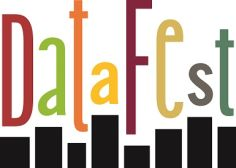
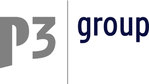
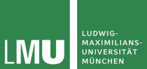
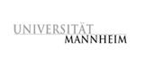

---
output:
  html_document:
    theme: readable
    self_contained: true
---

# Datafest Germany 2016

## Was ist DataFest Germany? 

Essen, hacken, Daten checken! Bezwinge einen wirklich großen Datensatz im Team mit bis zu vier Freunden!  
Kommt vom 1. bis 3. April nach München und macht aus richtig vielen Daten richtig gute Information!  
Präsentiert eure Ergebnisse, überzeugt die Jury und beeindruckt nebenbei potentielle Arbeitgeber.

Das erste [DataFest Germany](https://gitlab.com/datafest15de/orga/blob/master/README.md) an der Uni Mannheim war im vergangenen Jahr ein großer Erfolg, die Ergebnisse kann man sich [hier](http://sswml.uni-mannheim.de/Teaching/DataFest%20Germany/) ansehen. Auch unsere Partneruniversitäten in den USA haben in den vergangenen Jahren Top-Erfahrungen damit gemacht:

- [Duke University](https://stat.duke.edu/datafest)
- [Princeton University](http://orfe.princeton.edu/datafest/)
- [UCLA](http://datafest.stat.ucla.edu/groups/datafest/)

## Was genau ist die Aufgabe und mit welchen Daten arbeite ich?

Die bereitgestellten Daten sollen eine Überraschung sein und werden erst beim DataFest bekannt gegeben. Soviel sei aber verraten: Geplant ist ein riesiger Datensatz von einem unserer Partner aus der Wirtschaft.  
In der Vergangenheit wurden beispielsweise Daten vom Los Angeles Police Department daraufhin ausgewertet, wie sich Kriminalität reduzieren lässt. Oder die Daten einer Dating-Website wurden daraufhin untersucht, nach welchen Merkmalen Leute sich ihre künftigen Dates aussuchen.

## Wer kann teilnehmen?

Studierende aller Fachrichtungen, insbesondere der Sozialwissenschaften, Statistik, Informatik und Wirtschaftswissenschaften. Ihr meldet euch als Team mit bis zu 5 Personen an.

## Wann und wo findet das DataFest statt?

Freitag, 1. April, 17 Uhr  bis Sonntag, 3. April, 14 Uhr

Ludwig-Maximilians-Universität München (Hauptgebäude am Geschwister-Scholl-Platz)  
Begrüßung: Raum E004  
Gruppentreffen:  Raum A120  
Catering: Raum F107

## Muss ich die ganze Zeit da sein?

Nein! Du kannst kommen und gehen wann Du möchtest. Allerdings ist es nicht erlaubt außerhalb des Veranstaltungsraums am Projekt zu arbeiten. Mindestens zwei Teammitglieder müssen zu Veranstaltungsbeginn anwesend sein.

## Was brauche ich, um mitzumachen?

Alles, was Du brauchst, ist ein Laptop und die Software, die Du am liebsten nutzt.  
Und Du brauchst Freunde, Kommilitonen oder einfach Mitstreiter, mit denen Du dich als Team anmeldest. Ein Team besteht aus mindestens 2 und maximal 5 Personen.

## Ich habe kein Team, kann ich mich trotzdem anmelden?

Wir haben auf Facebook eine [DataFest-Seite](https://www.facebook.com/groups/DataFestGermany/) eingerichtet. Dort kannst Du dich mit anderen Interessenten zu einem Team zusammenschließen. 

## Wie kann ich mich anmelden?

Du kannst dich bis 1.3.2016 [hier](https://docs.google.com/forms/d/1vlDa3gnup3qiFaEhJ5xOWNZ7Apn43h_3oIcxU1iGm48/viewform) anmelden.  
Zur verbindlichen Anmeldung muss eine Teilnahmegebühr in Höhe von 20€ pro Team überwiesen werden.

[Zum Anmeldeformular](https://docs.google.com/forms/d/1vlDa3gnup3qiFaEhJ5xOWNZ7Apn43h_3oIcxU1iGm48/viewform)

Da die Plätze begrenzt sind, können nur die 10 Teams teilnehmen, die sich zuerst anmelden. 

## Was kann ich gewinnen?

Preise, Ruhm, Ehre oder ein gewichtetes Mittel davon!  
Präsentiert die Ergebnisse in einer sehr kurzen Präsentation einer bunt gemischten Jury, die sich aus Experten aus verschiedenen Berufsfeldern zusammensetzt. Gewinnen kann man in den Kategorien

- __Best Insight__
- __Best Visualization__
- __Best Use of Outside Data__
 
## Was sollte ich sonst noch über DataFest wissen?

Das DataFest ist Wettbewerb und interdisziplinäres Team-Event zugleich, bei dem ihr die einzigartige Möglichkeit habt, große Datenmengen zu bearbeiten und nach euren Ideen auszuwerten. Außerdem könnt ihr ganz ungezwungen mit führenden Köpfen der Statistik sowie Unternehmen in Kontakt treten.

## Wo kann ich übernachten?

Wenn Du Isomatte und Schlafsack mitbringst, kannst Du in einem großen Saal mit anderen DataFest-Teilnehmern übernachten. [Hier [pdf]](files/Uebernachtungsadressen.pdf) findest Du eine Liste von günstigen Hostels in München. 

## Wie werde ich satt?

Wir sorgen für ausreichend gesunde und ungesunde Nahrungsmittel und Getränke rund um die Uhr.

## Noch Fragen?

Dann poste bitte in der [Datafest-Facebook-Gruppe](https://www.facebook.com/groups/DataFestGermany/) oder wende dich per Mail an [Verena Maier](mailto:Verena.Maier@stat.uni-muenchen.de)

## Veranstalter

  
