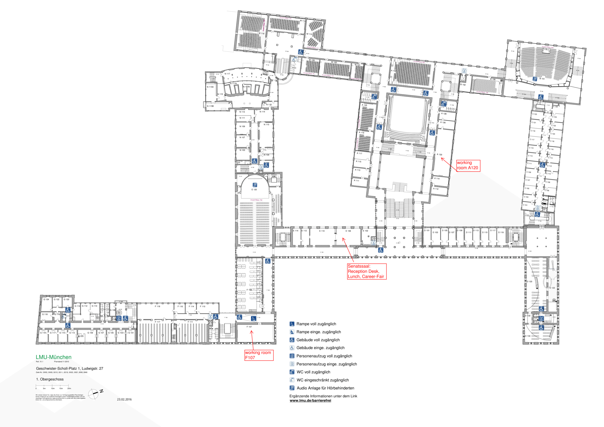
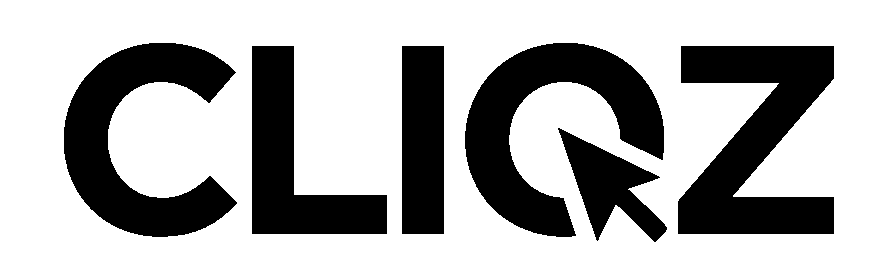

---
output:
  rmdformats::html_clean:
    self_contained: true
    lightbox: true
---

# DataFest Germany 2016

## Was ist DataFest Germany? 

Essen, hacken, Daten checken! Bezwinge einen wirklich großen Datensatz im Team mit bis zu vier Freunden!  
Kommt vom 1. bis 3. April nach München und macht aus richtig vielen Daten richtig gute Information!  
Präsentiert eure Ergebnisse, überzeugt die Jury und beeindruckt nebenbei potentielle Arbeitgeber.

Das erste [DataFest Germany](https://gitlab.com/datafest15de/orga/blob/master/README.md) an der Uni Mannheim war im vergangenen Jahr ein großer Erfolg, die Ergebnisse kann man sich [hier](http://sswml.uni-mannheim.de/Teaching/DataFest%20Germany/) ansehen. Organisiert wird es in diesem Jahr ebenfalls wieder vom einem Konsortium aus dem [Lehrstuhl für Statistik und sozialwissenschaftliche Methodenlehre der Universität Mannheim](http://sswml.uni-mannheim.de/), dem [Institut für Statistik der LMU München](http://www.stat.uni-muenchen.de/), der [P3 Group](http://www.p3-group.com) und der American Statistical Association ([ASA](http://www.amstat.org/)).

Auch unsere Partneruniversitäten in den USA haben in den vergangenen Jahren Top-Erfahrungen damit gemacht:

- [Duke University](https://stat.duke.edu/datafest)
- [Princeton University](http://orfe.princeton.edu/datafest/)
- [UCLA](http://datafest.stat.ucla.edu/groups/datafest/)

## Wann und wo findet das DataFest statt?

Freitag, 1. April, 17 Uhr  bis Sonntag, 3. April, 14 Uhr

Ludwig-Maximilians-Universität München  
Hauptgebäude am Geschwister-Scholl-Platz  
U-Bahn-Station: "Universität"  
[Karte [OSM]](http://www.openstreetmap.org/?mlat=48.15093&mlon=11.57984#map=17/48.15093/11.57984&layers=Q)

  

### Anreise per Auto: 

Parkplätze rund ums Hauptgebäude der LMU sind rar -- wir empfehlen die Anreise mit den öffentlichen Verkehrmitteln. [[Münchner Verkehrsverbund]](http://www.mvv-muenchen.de/)

### Anreise per Zug:

Vom Hauptbahnhof München mit U-Bahn U4 (Richtung Arabellapark) oder U5 (Richtung Neuperlach Süd) zum Odeonsplatz (2 Stationen). Dort in die U3 (Richtung Olympia-Einkaufszentrum) oder U6 (Richtung Garching-Forschungszentrum) umsteigen und an der Haltestelle Universität aussteigen (1 Station). In Fahrtrichtung den Bahnsteig entlanglaufen, der Nordausgang der Station ist direkt am Hauptgebäude der LMU.
[[Münchner Verkehrsverbund]](http://www.mvv-muenchen.de/)

## Ablauf

**Freitag:**

Zeit         |  Was & Wo
-------------|-----------------------------------------
18:00 - 19:00| Anmeldung (Senatssaal E106)
19:00 - 20:00| *Meet & greet the data* (E004)
20:00 - 21:00| Dinner (Senatssaal E106)
Nachts       | An die Arbeit! (A120 , F107, Teamräume (s.u.)) 

Berater sind bis Mitternacht vor Ort.

**Samstag:**

Zeit          |  Was & Wo
--------------|-----------------------------------------
09:00 - 11:00 | Frühstück (Senatssaal E106) 
13:00 - 14:30 | Lunch (Senatssaal E106)
16:00 - 18:00 | Career Fair (Senatssaal E106 / Rektorenzimmer)
18:30 - 20:00 | Dinner (Senatssaal E106)
Nachts        | An die Arbeit! (A120 , F107, Teamräume (s.u.)) 

Berater sind bis Mitternacht vor Ort.

**Sonntag:**

Zeit          |  Was & Wo
--------------|-----------------------------------------
09:00 - 11:30 | Frühstück (Senatssaal E106)
11:30  | Ende der Bearbeitung & Abgabe der Abschlusspräsentationen 
12:00 - 14:15| Präsentationen  (E004)
14:15 - 14:30| Jury berät sich / Gruppenfoto (E004)
14:30 - 15:00| Preisverleihung  (E004)

**Schedule in english: [[pdf]](files/public_schedule_v01.pdf)**

### Raumplan

Je zwei bis drei Teams teilen sich einen Aufenthaltsraum in dem in Ruhe gearbeitet und ausgeruht werden kann:

Raum   | Teams
-------|-----------
C 005  | DatenKnechte, Mannheimer Psychologen
C 009  | DataAnimals, R-Furcht
C 016  | R-squared Mannheim, DataRtists
C 022  | Heavy Tails, The final Estimation
B 011  | SozioLogits, DeepForest, supeRuser
A 020  | FAUdatalyze, R-Force
DZ 001 | AngSt, Angst 2.0
DZ 003 | Statisfaction, RatedR, TheScatterplotter
DZ 005 | Joint Modelling, Diverse Impact
DZ 007 | Otto-Normalverteilung, expeRience

Alle Räume sind im Hauptgebäude der LMU am Geschwister-Scholl-Platz.

## Downloads

Guideline for Participants [[pdf, in english]](files/StudentsInfosandGuidelines.pdf).

Schedule [[pdf, in english]](files/public_schedule_v01.pdf)

Gebäudeplan [[pdf]](files/Senatssaal_v01.pdf).

<!--
## NEWS

**23.03.**: Raumaufteilung für die Teams ist online.

**22.03.**: Ablaufplan ist online [[pdf]](files/public_schedule_v01.pdf), Gebäudeplan auch [[pdf]](files/Senatssal_v01.pdf).

**22.03.**: Guideline für Teilnehmer ist online [[pdf]](files/Guidelines_Students_v01.pdf).

-->

## Was genau ist die Aufgabe und mit welchen Daten arbeite ich?

Die bereitgestellten Daten sollen eine Überraschung sein und werden erst beim DataFest bekannt gegeben. Soviel sei aber verraten: Geplant ist ein riesiger Datensatz von einem unserer Partner aus der Wirtschaft.  
In der Vergangenheit wurden beispielsweise Daten vom Los Angeles Police Department daraufhin ausgewertet, wie sich Kriminalität reduzieren lässt. Oder die Daten einer Dating-Website wurden daraufhin untersucht, nach welchen Merkmalen Leute sich ihre künftigen Dates aussuchen.  
Weitere Infos gibt's auch in unserer Guideline für Teilnehmer [[pdf]](files/StudentsInfosandGuidelines.pdf).

<!--
## Wie kann ich mich anmelden?

 
Du kannst Dich und Dein Team bis 1.3.2016 [hier](https://docs.google.com/forms/d/1vlDa3gnup3qiFaEhJ5xOWNZ7Apn43h_3oIcxU1iGm48/viewform) anmelden.  
Zur verbindlichen Anmeldung muss eine Teilnahmegebühr in Höhe von 10€ pro Teammitglied überwiesen werden.

[Zum Anmeldeformular](https://docs.google.com/forms/d/1vlDa3gnup3qiFaEhJ5xOWNZ7Apn43h_3oIcxU1iGm48/viewform)

Bitte lies Dir zuerst auch die [FAQ](faq.html) durch.

Die Plätze sind begrenzt, also am besten gleich anmelden! Falls sich die Plätze sehr schnell füllen werden Teams mit mehr Mitgliedern bevorzugt behandelt um möglichst vielen Leuten die Chance zu geben am DataFest teilzunehmen. Bitte rechnet mit ein paar Tagen Verzögerung zwischen Eurer Anmeldung und der Zusendung der Bankdaten für die Überweisung.

Die Plätze waren begrenzt, leider sind dieses Jahr keine weiteren Anmeldungen mehr möglich. 
-->

## Häufige Fragen

... werden [hier](faq.html) beantwortet.  
Oder nimm auf [Facebook](https://www.facebook.com/groups/DataFestGermany/) mit uns Kontak auf.

Eine Guideline für Teilnehmer gibt es [hier [pdf]](files/StudentsInfosandGuidelines.pdf).

## Sponsoren

  

  
&nbsp;  

  

  

 &nbsp;  &nbsp;  &nbsp;  &nbsp;  &nbsp; 

## Veranstalter

 

<small>

### Impressum

**Anschrift:**  
Institut für Statistik  
Ludwigstraße 33  
D-80539 München  

Telefon: +49 (0)89 / 2180-3195 (Geschäftsstelle)  
Telefax: +49 (0)89 / 2180-5041 (Geschäftsstelle)  

**Verantwortlich für den Inhalt:**  
Fabian Scheipl

**Zuständige Aufsichtsbehörde:**  
Bayerisches Staatsministerium für Wissenschaft, Forschung und Kunst  
80327 München  
Umsatzsteuer-Identifikationsnummer gemäß § 27 a Umsatzsteuergesetz: DE 811205325

**Haftungsausschluss:**  
Alle Angaben auf diesen Seiten wurden nach bestem Wissen erstellt, Fehler können jedoch nicht mit letzter Sicherheit ausgeschlossen werden. Rechtlich verbindlich sind ausschließlich die Festlegungen in den einschlägigen Rechtsgrundlagen (Gesetze, Verordnungen, Satzungen).

Diese Seiten enthalten Links zu externen Angeboten. Trotz sorgfältiger Kontrolle wird keine Haftung für diese übernommen. Für den Inhalt der verlinkten Seiten sind ausschließlich deren Betreiber verantwortlich.

</small>

